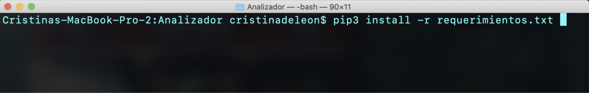
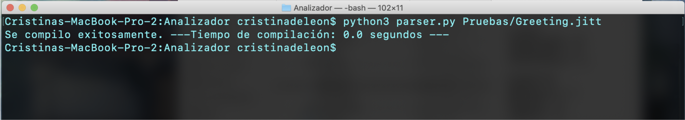
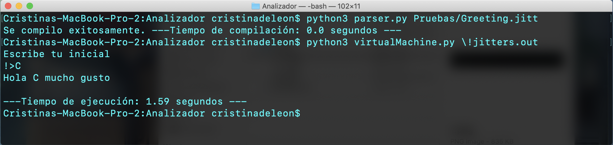

# !Jitters
Proyecto para la clase de Diseño de Compiladores Feb-Jun 2020

					

## Manual de Usuario

##

# Requerimientos de ambiente:

- Contar con la versión de Python 3.0+
- Importar la librería &quot;ply&quot; y &quot;numpy&quot;

# Pasos a seguir:

1. Abrir terminal e ir al Folder -Jitters/Analizador

2. En caso de no contar con las librerías, correr el comando:

		<pip3 / pip> install -r requerimientos.txt

	

3. Compilar el archivo tipo .jitt utilizando este comando:

		<python3 / py> parser.py <archivo>.jitt

	

4. Para ejecutar tu archivo compilado, corre el siguiente comando:

		<python3 / py> virtualMachine.py <\!jitters.out / "!jitters.out">

	

#¡Listo! Puedes jugar probando con nuestros código ejemplos en el Folder/Pruebas.
