# !Jitters
Proyecto para la clase de Diseño de Compiladores Feb-Jun 2020

  

## Manual de Usuario

##

# Requerimientos de ambiente:

- Contar con la versión de Python 3.0+
- Importar la librería &quot;ply&quot; y &quot;numpy&quot;

# Pasos a seguir:

1. Abrir terminal e ir al Folder -Jitters/Analizador

2. En caso de no contar con las librerías, correr el comando:

		<pip3 / pip> install -r requerimientos.txt

	

3. Compilar el archivo tipo .jitt utilizando este comando:

		<python3 / py> parser.py <archivo>.jitt

	

4. Para ejecutar tu archivo compilado, corre el siguiente comando:

		<python3 / py> virtualMachine.py <\!jitters.out / "!jitters.out">

	

**Información General:**

Tipos:

!Jitters cuenta con 3 tipos principales para la codificación de los programas: &#39;int, float y char&#39;, adicionalmente el lenguaje sabe manejar otros tipos que no pueden ser explícitamente usados para la definición de variables: &#39;void y bool&#39;. Estos últimos dos tienes sus propias restricciones ya que &#39;bool&#39; es uno que se usa cuando se evalúan expresiones lógicas y &#39;void&#39; es parte de los tipos de funciones.

Variables:

La estructura para definición de variables en !Jitters requiere del uso de la palabra reservada &#39;var&#39; seguido de: &#39;tipo : nombre;&#39; cada que se encuentra un tipo se pueden definir varias variables mientras estén separadas por una coma, y se pueden incluir varios tipos de variables mientras que las estructura de tipo esté separada por &#39;;&#39;.

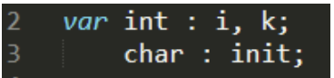

Varables Dimesnionadas:

En !Jitters se permiten tener variables con hasta 2 dimensiones que en esta caso serían matrices y arreglos, su definición necesita seguir la estructura normal de variables con la diferencia de que si se desea agregar una dimensión a la variable se debe de agregar lo siguiente: &#39;[size]&#39;. Si se desean dos dimensiones se agrega lo anterior 2 veces. El número que ingreses dentro de la estructura definirá el tamaño de tu variable dimensionada. Es importante notar que el indexamiento de estas empieza en 0.

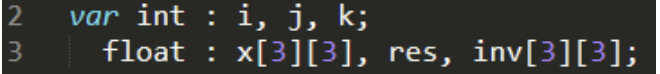

Funciones:

Las funciones en !Jitters requieren el uso de la palabra reservada &#39;función&#39; también se les debe especificar el tipo de retorno. Es importante notar que cuando se especifica void la función no esperara un retorno y el regresar algo marcará error. La definición de las variables necesita ir antes de los estatutos. Las variables que se definan en funciones tienen precedencia sobre las globales por lo que si se define una variable con el mismo nombre que una global, el compilador le dará precedencia a el valor de la local.

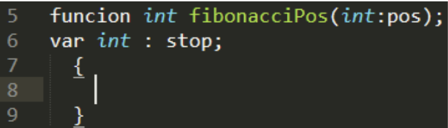

Parámetros:

La definición de parámetros en las funciones es muy similar a la definición de variables lo único es que cada paramento debe tener su tipo especificado y cada tipo tiene que estar separado por comas, el orden en el que se definen los tipo es irrelevante. La definición de parámetros se hace antes que la de variables por lo cual no se pueden definir variables con nombres de parámetros

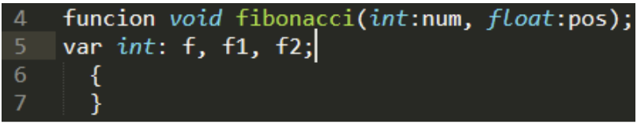

Estatutos:

Los estatutos en !Jitters son los que permiten hacer las operaciones, estos tienen que ir dentro de el bloc de alguna función. Los estatutos permitidos en este lenguaje son los siguientes:

- Asignación: permite asignar un valor a una variable
- Función Void: permite realizar una llamada a una función void

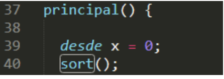

- Retorno: específico para las funciones que tengan un retorno, especifica el valor a regresar

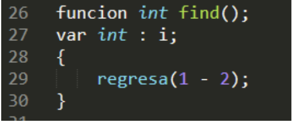

- Lectura: función de input que lee algo de la terminal y lo guarda en una variable
- Escritura: función de output que toma el valor de una expresión y lo imprime en la terminal

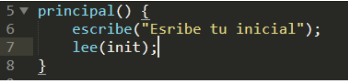

- Decisión: estatuto condicional que evalúa una expresión y realiza ciertos estatutos según la condición

- Repetición: estatuto condicional que evalúa una expresión y repite la realización de ciertos estatutos hasta que la condición no se cumpla

Expresiones:

Las expresiones en !Jitters son la manera de evaluar valores ya sea una suma de variables o una multiplicación de matrices. En la evaluación de expresiones es donde entra el segundo tipo especial del lenguaje el &#39;bool&#39;. Ciertas evaluaciones de expresiones nos regresan un valor de &#39;True&#39; o &#39;False&#39; que sirve en los estatutos condicionales para realizar la evaluación

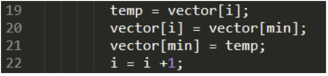

Operaciones:

Las operaciones son las que pueden ser utilizadas en las expresiones para modificar la información, la mayoría de las operaciones solo funciona con variables no dimensionadas pero hay excepciones que se marcan. La siguiente es la lista de expresiones:

- \* : multiplicación (normal o dimensionada)
- / : división
- + : suma (normal o dimensionada)
- - : resta (normal o dimensionada)
- \&gt; : mayor que
- \&lt; : menor que
- != : no igual a
- ~= : igual a
- &amp; : AND
- | : OR
- $: determinante (Dimensionada)
- ¡: inversa (Dimensionada)
- ?: transpuesta (Dimensionada)

Commentarios:

Para agregar commentario en !Jitters se necesita proceder del commentario con un &#39;#&#39;, esto hará que la línea que tiene este símbolo sea ignorada.

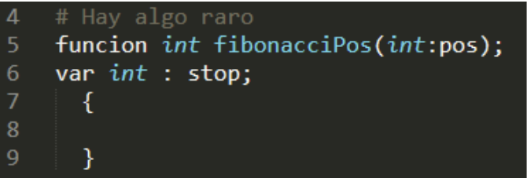

**Estructura de los Programas:**

!Jitters es un lenguaje funcional por lo cual todos los programas requieren de una función &#39;principal&#39; que sirve como el inicio de todos los programas, después de nombre del programa se pueden definir las variables globales que siguen la estructura de definición de variables.

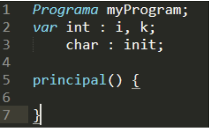

Para declarar funciones se tiene que hacer después de la declaración de variables globales están son denotadas por la palabra reservada &#39;función&#39; y requieren seguir la estructura &#39;función tipo Nombre(parámetros); variables {}&#39;. Dentro de los corchetes es donde se pueden escribir estatutos.

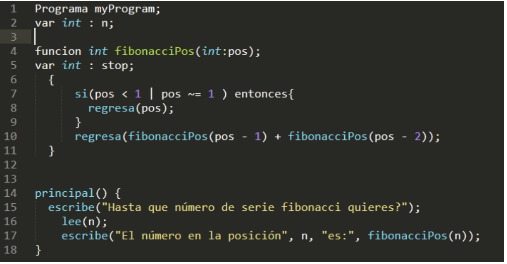

Dentro de la función principal o cualquier función se pueden escribir los estatutos de forma lineal y esto permite compilar los programas. Un ejemplo de un código estructurado es el siguiente:

   ¡Listo! Puedes jugar probando con nuestros código ejemplos en el Folder/Pruebas.
   

   Documentación Completa: [Drive](https://docs.google.com/document/d/1v2ModO1dG24Syhx_a1rV4Rqa2omqmPQKaMKok7VqvF0/edit?usp=sharing)
En video: [youtube](https://youtu.be/YTXOgUCIDys)

